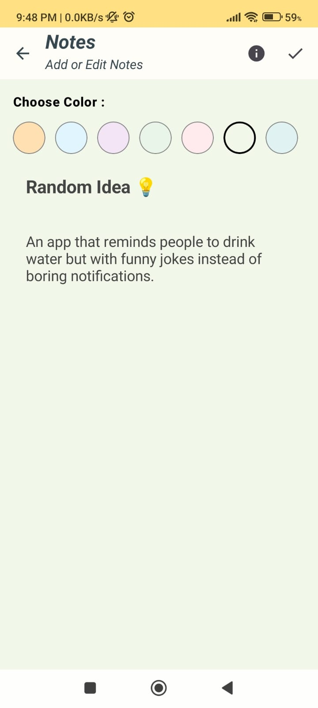
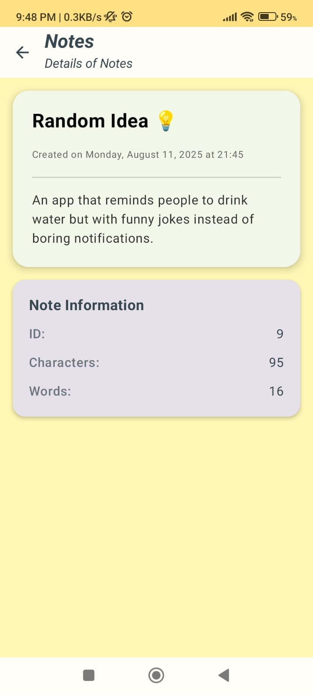
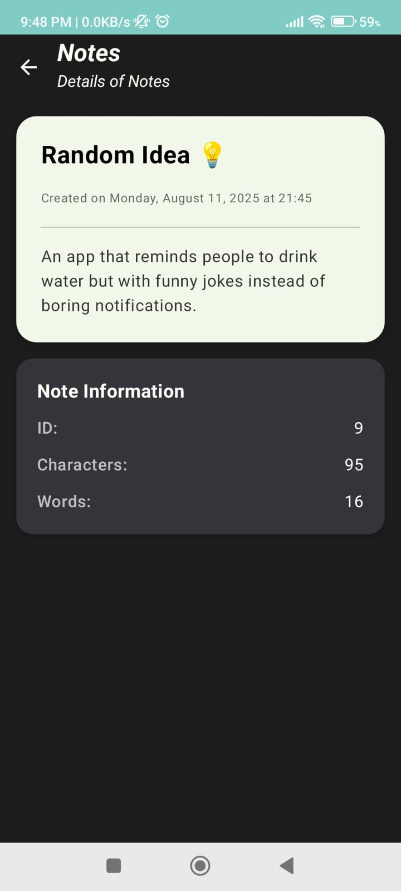
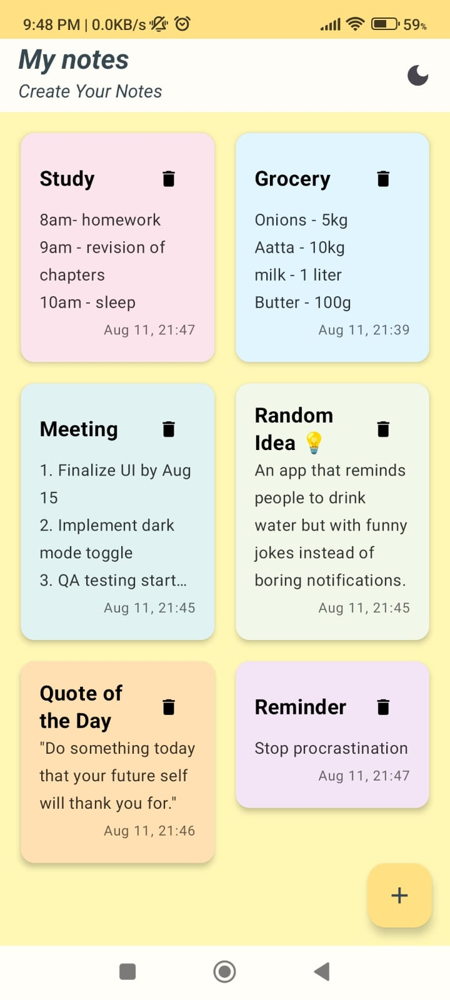
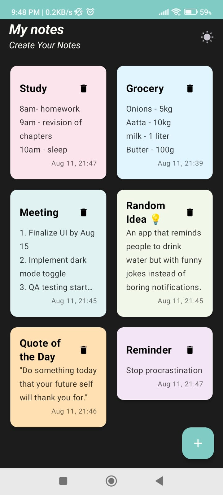

# 📒 NoteApp  

[](https://kotlinlang.org/)  
[](https://developer.android.com/jetpack/compose)  
[](LICENSE)  

A **beautiful & minimal Note-Taking Android App** built with **Kotlin**, **Jetpack Compose**, and **Clean Architecture**.  
Organize your thoughts effortlessly with a modern UI and smooth user experience.  

---

## ✨ Features  
- 📝 Create, edit, and delete notes  
- 🎨 Assign custom colors to notes  
- 📅 save with timestamps  
- 💾 Offline storage with Room  
- 🖥 Built on **Clean Architecture + MVVM**  

---

## 🛠 Tech Stack  
- **Language:** Kotlin  
- **UI:** Jetpack Compose, Material 3  
- **Architecture:** Clean Architecture + MVVM  
- **Database:** Room  
- **DI:** Hilt  
- **Async:** Kotlin Coroutines & Flow  

---

## 📸 Screenshots

<table align="center">
  <tr>
    <th>Edit Screen (Dark)</th>
    <th>Edit Screen (Light)</th>
    <th>Detail Screen (Dark)</th>
    <th>Detail Screen (Light)</th>
    <th>Note Screen (Dark)</th>
    <th>Note Screen (Light)</th>
  </tr>
  <tr>
    <td></td>
    <td></td>
    <td></td>
    <td></td>
    <td></td>
    <td></td>
  </tr>
</table>

---
## 📥 Download
You can [download the latest APK here](https://github.com/your-username/NoteApp/releases) and install it on your Android device.

## 📦 Setup & Installation
1. **Clone the repository**  
   ```bash
   git clone https://github.com/Mayur-Suryawanshi07/NoteApp.git

2. **Open the project in Android Studio**  
   - Go to **File > Open**  
   - Select the cloned project folder.

3. **Sync Gradle**  
   - Android Studio will prompt you to sync Gradle files.  
   - Click **"Sync Now"**.

4. **Run the app**  
   - Connect an Android device or start an emulator.  
   - Click the **Run ▶️** button in Android Studio.
     
  ---

## 🛠 Requirements
- **Android Studio** Hedgehog or newer  
- **Java** 17 or higher  
- **Android SDK** 24+  
- Internet connection for API calls  

## 📦 Dependencies
- **Jetpack Compose** – Modern UI toolkit  
- **Room Database** – Local storage  
- **Hilt** – Dependency Injection  
- **Material 3** – UI Components  
- **Retrofit** – Networking  

## 📂 Project Structure

NoteApp/
 ├── app/                   # Main Android application
 │   ├── data/               # Repository, database, API
 │   ├── domain/             # Use cases, models
 │   ├── presentation/       # UI (Jetpack Compose screens)
 │   └── di/                 # Hilt dependency injection
 ├── screenshots/           # App screenshots
 └── build.gradle

 ## 📜 License
This project is licensed under the MIT License – see the [LICENSE](LICENSE) file for details.


